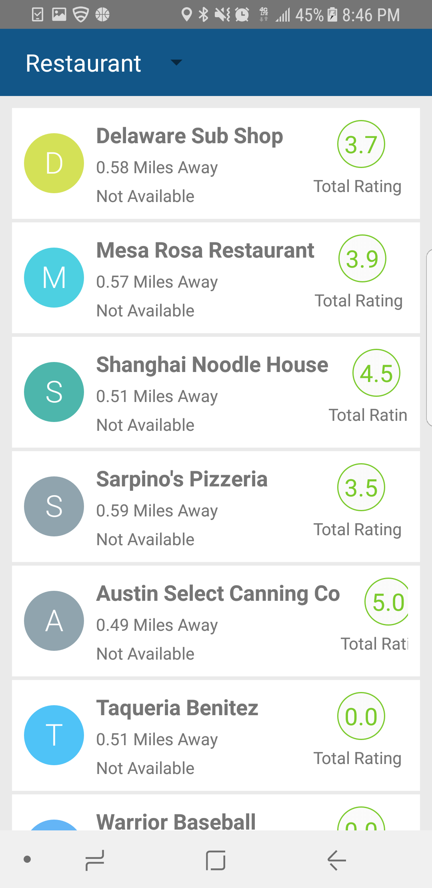
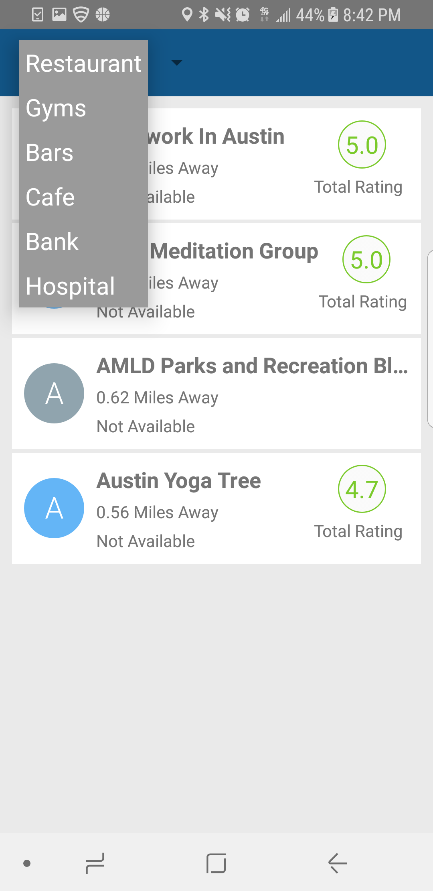
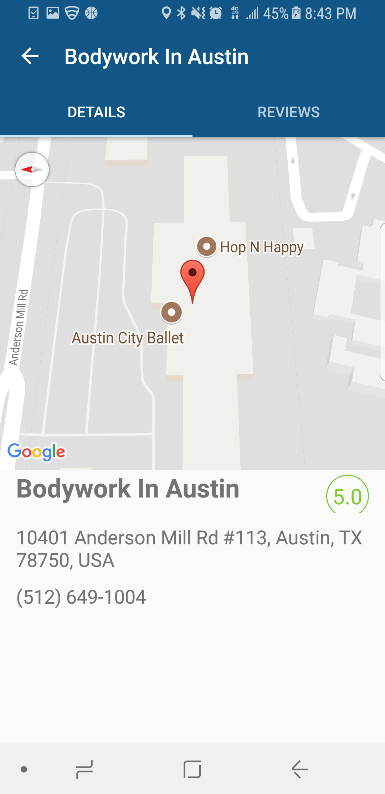

# Google-Places

Right now, Only options for Restaurant,Gyms,Bars,Cafe,Bank and Hospital.

###### Add Following code snippet in build.gradle and you are good to go.

```
dependencies {
    compile fileTree(dir: 'libs', include: ['*.jar'])
    testCompile 'junit:junit:4.12'
    compile 'com.android.support:appcompat-v7:23.1.1'
    compile 'com.android.support:design:23.1.1'
    compile 'com.google.android.gms:play-services:8.4.0'
    compile 'com.google.code.gson:gson:2.6.2'
    compile 'com.squareup.retrofit2:retrofit:2.0.2'
    compile 'com.squareup.retrofit2:converter-gson:2.0.2'
    compile 'com.squareup.picasso:picasso:2.5.2'
    compile 'uk.co.chrisjenx:calligraphy:2.1.0'
    compile 'com.amulyakhare:com.amulyakhare.textdrawable:1.0.1'
    compile 'de.hdodenhof:circleimageview:2.0.0'
    compile 'com.akexorcist:googledirectionlibrary:1.0.4'
    compile 'com.squareup.okhttp3:logging-interceptor:3.2.0'
}
```
###### ScreenShots
          